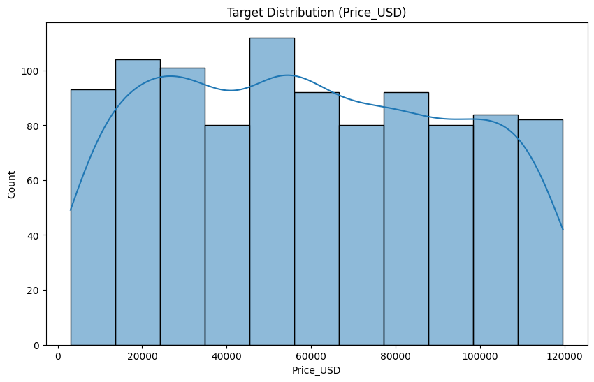
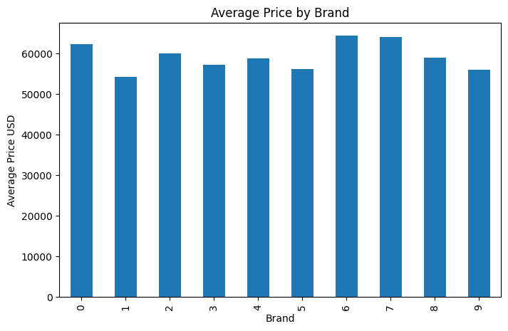
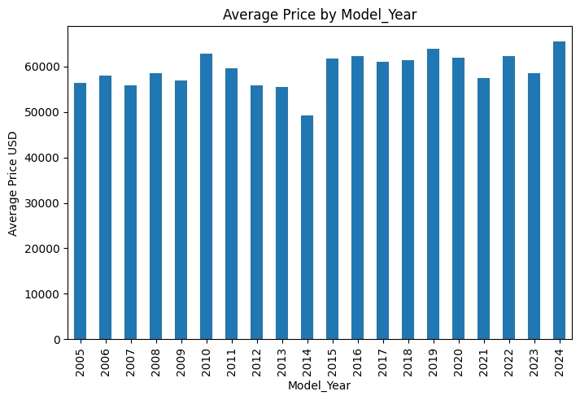
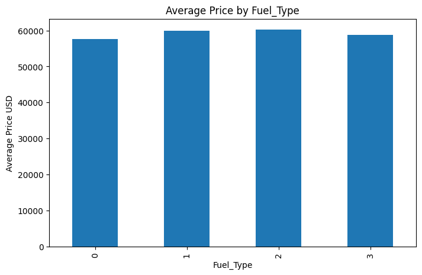
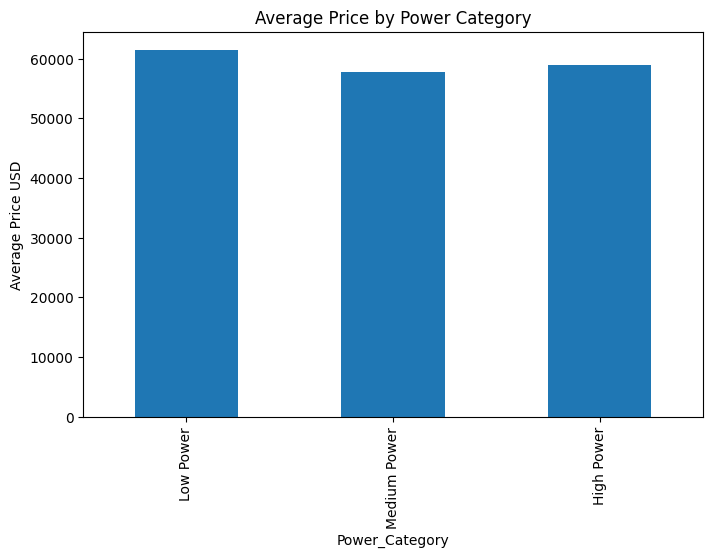
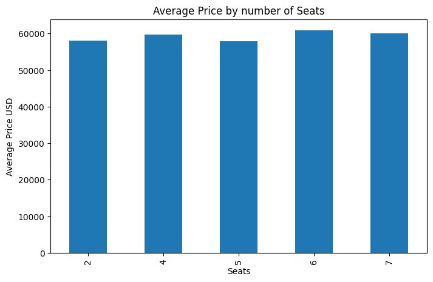
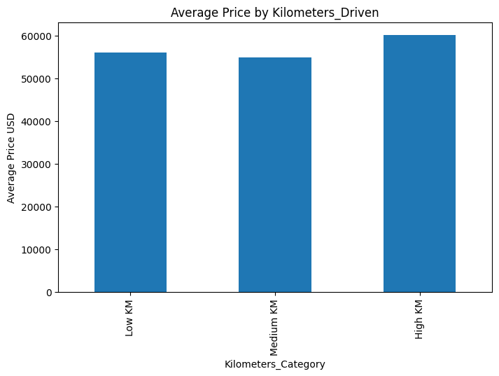
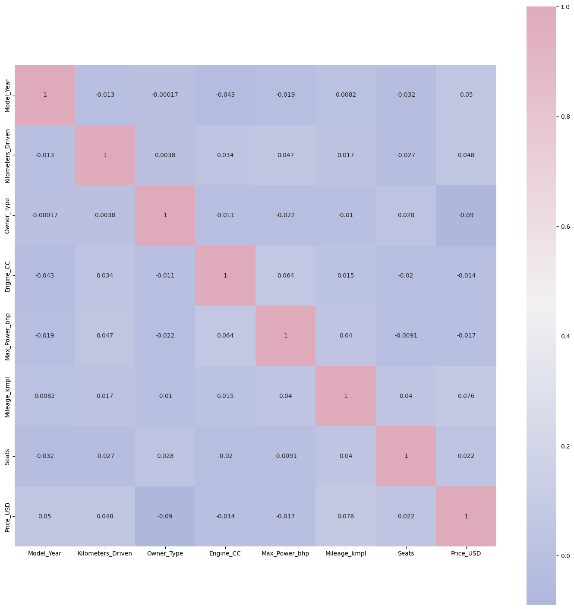
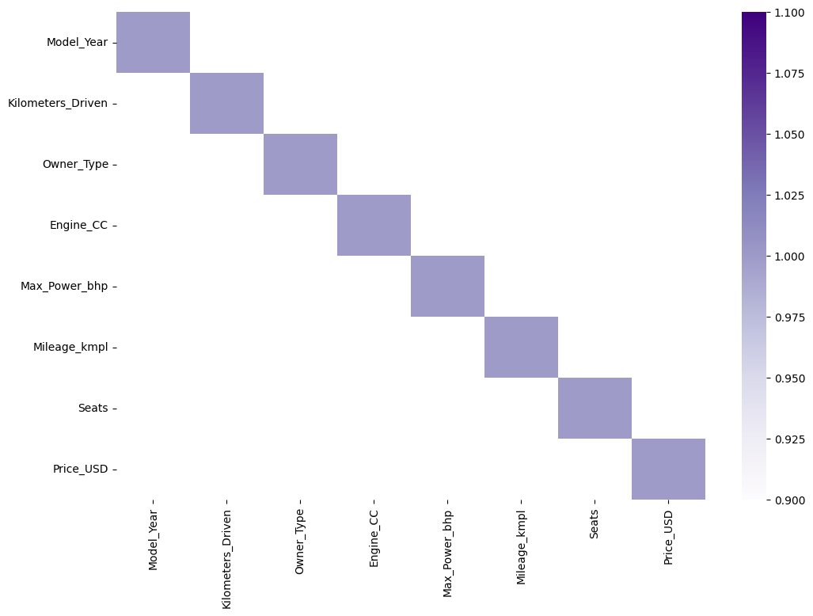

# **École Nationale de Commerce et de Gestion (ENCG) - 4ème Année**

# **Projet : Analyse de Données et Modélisation pour la Prédiction Automobile**

## **Introduction Générale**

Dans ce document, nous présentons une analyse complète d'un jeu de
données automobile et le processus de préparation des données en vue de
construire un modèle de Machine Learning. Ce travail s'inscrit dans un
thème général d'**analyse prédictive**, où nous transformons des données
brutes en informations utilisables par un modèle.

L'objectif de l'analyse est de comprendre les caractéristiques du
dataset, traiter les données manquantes, encoder les variables
catégorielles, explorer la distribution des variables, puis préparer le
tout pour la modélisation.

## **Sommaire Détaillé**

1.  **Introduction générale** -- Présentation du thème et du contexte
2.  **Description du notebook** -- Structure et objectifs
3.  **Analyse et préparation des données**
    -   Chargement du dataset\
    -   Nettoyage et traitement des valeurs manquantes\
    -   Encodage des variables catégorielles\
    -   Analyse exploratoire : distributions, corrélations\
4.  **Explication détaillée de chaque cellule de code**\
5.  **Conclusion** -- Synthèse de l'analyse et implications

## **Description du Notebook**

Le notebook contient une succession de cellules de code et de texte
visant à préparer les données étape par étape. Chaque cellule est
reproduite ci‑dessous accompagnée d'une explication complète.

## **Explications Détaillées des Cellules**

### 💻 Cellule de Code 1

``` python
#Importing Libraries
import pandas as pd
import numpy as np
import matplotlib.pyplot as plt
import seaborn as sns

#For ignoring warning
import warnings
warnings.filterwarnings("ignore")
```

#### 🧠 Explication du code

Ce bloc de code me permet d’importer les bibliothèques essentielles dont j’ai besoin pour réaliser mon analyse de données automobile.

pandas (pd) : j’utilise cette bibliothèque pour charger mon dataset et manipuler mes données (par exemple les caractéristiques des voitures).

numpy (np) : elle me sert à effectuer des calculs numériques nécessaires lors de la préparation de mes données.

matplotlib (plt) et seaborn (sns) : je m’en sers pour créer des visualisations afin d’explorer mon dataset, analyser mes variables, comprendre les tendances et identifier des relations entre les caractéristiques automobiles.

warnings.filterwarnings("ignore") : j’utilise cette instruction pour masquer les avertissements non importants et garder mon notebook clair et lisible.

Ainsi, ce bloc initialise mon environnement d’analyse, indispensable pour la préparation de mes données et la construction de mon futur modèle de prédiction automobile.

### 💻 Cellule de Code 2

``` python
df=pd.read_csv('/content/drive/MyDrive/Analyse_PayGapEurope/car_price_dataset_medium.csv')
df
```

#### 🧠 Explication du code

J’utilise pd.read_csv() pour charger mon fichier contenant les données automobiles.
La variable df devient mon tableau principal, et l’afficher me permet de voir immédiatement la structure et le contenu de mon dataset.

### 💻 Cellule de Code 3

``` python
df.shape
```

#### 🧠 Explication du code

J’utilise df.shape pour connaître le nombre de lignes et de colonnes dans mon dataset.

### 💻 Cellule de Code 4

``` python
#Checking for Duplicates
df.duplicated().sum()
```

#### 🧠 Explication du code

J’utilise cette commande pour compter combien de lignes sont dupliquées dans mon dataset.

### 💻 Cellule de Code 5

``` python
#Removing Duplicates
df=df.drop_duplicates()
```

#### 🧠 Explication du code

J’utilise drop_duplicates() pour supprimer toutes les lignes répétées dans mon dataset.

### 💻 Cellule de Code 6

``` python
#Checking for null values
df.isnull().sum()
```

#### 🧠 Explication du code

J’utilise cette commande pour compter le nombre de valeurs manquantes dans chaque colonne de mon dataset.

### 💻 Cellule de Code 7

``` python
df.info()
```

#### 🧠 Explication du code

J’utilise df.info() pour obtenir un résumé complet de mon dataset :

le nombre de lignes,

le nombre de colonnes,

le type de chaque variable,

la présence ou non de valeurs manquantes.

### 💻 Cellule de Code 8

``` python
df.describe()
```

#### 🧠 Explication du code

J’utilise df.describe() pour obtenir les statistiques principales de mes variables numériques : moyenne, minimum, maximum, écart-type, quartiles…

### 💻 Cellule de Code 9

``` python
from sklearn import preprocessing
le = preprocessing.LabelEncoder()

df['Brand'] = le.fit_transform(df['Brand'])
df['Fuel_Type'] = le.fit_transform(df['Fuel_Type'])
df['Transmission'] = le.fit_transform(df['Transmission'])
df['Owner_Type'] = le.fit_transform(df['Owner_Type'])
```

#### 🧠 Explication du code

Cette partie encode les variables catégorielles en valeurs numériques
pour permettre leur utilisation par un modèle.

### 💻 Cellule de Code 10

``` python
#Let's check what's happened now
df
```

#### 🧠 Explication du code

Cette cellule contribue au flux général d'analyse ou de préparation des
données.

### 💻 Cellule de Code 11

``` python
df.info()
```

#### 🧠 Explication du code

Cette cellule contribue au flux général d'analyse ou de préparation des
données.

### 💻 Cellule de Code 12

``` python
# Let's check the distribution of Target variable.
# Using histplot because Price_USD is numerical
plt.figure(figsize=(10, 6))
sns.histplot(df['Price_USD'], kde=True)
plt.title('Target Distribution (Price_USD)')
plt.show()
```

#### 🧠 Explication du code

Afin d'évaluer la répartition de ma variable cible (Price_USD), j'ai généré un histogramme complété par une estimation de densité (KDE) en utilisant la librairie Seaborn. Cette visualisation graphique est essentielle pour que je puisse identifier la forme de ma distribution (symétrique, asymétrique) et détecter la présence éventuelle de valeurs aberrantes, informations qui influenceront mes choix de prétraitement et de modélisation.



### 💻 Cellule de Code 13

``` python
# Define your threshold
price_limit = 60000

# Count values greater than the limit
expensive_cars = df[df['Price_USD'] > price_limit].shape[0]

# Count values less than the limit
cheaper_cars = df[df['Price_USD'] < price_limit].shape[0]

print(f"Cars with Price > {price_limit}: {expensive_cars}")
print(f"Cars with Price < {price_limit}: {cheaper_cars}")
```

#### 🧠 Explication du code

J'ai souhaité effectuer une analyse de l'asymétrie de ma variable cible en définissant un seuil de prix à 60 000 USD. Cette démarche m'a permis de distinguer clairement les véhicules considérés comme coûteux de ceux qui sont plus abordables dans mon jeu de données.

### 💻 Cellule de Code 14

``` python
# function for plotting
def plot(col, df=df):
    return df.groupby(col)['Price_USD'].mean().plot(kind='bar', figsize=(8,5), ylabel='Average Price USD')
```

#### 🧠 Explication du code

J'ai créé ma propre fonction Python nommée plot dans le but d'automatiser et de simplifier mes analyses de données exploratoires (EDA). Cette fonction me permet de regrouper mes données par n'importe quelle colonne catégorielle spécifiée (col) et de calculer la moyenne du prix en USD (Price_USD) pour chaque catégorie. En retournant directement un diagramme à barres, ma fonction me fait gagner du temps en visualisant instantanément l'impact de chaque caractéristique (marque, couleur, type de moteur, etc.) sur le prix moyen des véhicules.

### 💻 Cellule de Code 15

``` python
plot('Brand')
plt.title('Average Price by Brand')
plt.show()
```

#### 🧠 Explication du code

J'ai immédiatement utilisé ma fonction personnalisée plot pour réaliser une analyse rapide de l'impact de la marque sur le prix moyen. En appelant plot('Brand'), je demande à mon système de calculer et d'afficher le prix moyen en USD pour chaque marque de voiture présente dans mon jeu de données.



### 💻 Cellule de Code 16

``` python
plot('Model_Year')
plt.title('Average Price by Model_Year')
plt.show()
```

#### 🧠 Explication du code

En réutilisant ma fonction plot, j'ai spécifiquement analysé la relation entre le prix moyen du véhicule et son année de modèle (Model_Year). Ce graphique me permet d'observer l'évolution du prix des voitures en fonction de leur ancienneté.



### 💻 Cellule de Code 17

``` python
plot('Fuel_Type')
plt.title('Average Price by Fuel_Type')
plt.show()
```

#### 🧠 Explication du code

J'ai poursuivi mon analyse exploratoire en utilisant à nouveau ma fonction plot pour examiner l'influence du type de carburant (Fuel_Type) sur le prix moyen des véhicules. L'affichage de ce diagramme à barres est important car il met en lumière les différences de valeur entre les voitures fonctionnant à l'essence, au diesel, ou avec des carburants alternatifs (comme l'électrique ou l'hybride).



### 💻 Cellule de Code 18

``` python
plot('Transmission')
plt.title('Average Price by Transmission')
plt.show()
```

#### 🧠 Explication du code

J'ai ciblé la variable type de transmission (Transmission) dans ma dernière analyse avec ma fonction plot. Ce graphique à barres me permet de comparer le prix moyen des véhicules équipés d'une transmission automatique par rapport à ceux ayant une transmission manuelle.


### 💻 Cellule de Code 19

``` python
# We split power into 3 groups: Low (<200), Medium (200-400), High (>400)
bins = [0, 200, 400, 1000]
labels = ['Low Power', 'Medium Power', 'High Power']
df['Power_Category'] = pd.cut(df['Max_Power_bhp'], bins=bins, labels=labels)

plot('Power_Category')
plt.title('Average Price by Power Category')
plt.show()
```

#### 🧠 Explication du code

J'ai effectué une étape de catégorisation sur ma variable continue Max_Power_bhp (puissance maximale), car cette transformation facilite l'analyse et la modélisation. J'ai défini trois groupes de puissance (Faible, Moyenne, Élevée) en utilisant des bornes (bins) spécifiques. J'ai ensuite appliqué ma fonction plot sur cette nouvelle variable catégorielle (Power_Category).



### 💻 Cellule de Code 20

``` python
plot('Seats')
plt.title('Average Price by number of Seats')
plt.show()
```

#### 🧠 Explication du code

En utilisant ma fonction plot, j'ai ciblé la variable Seats pour analyser son effet sur le prix moyen.



### 💻 Cellule de Code 21

``` python
# We split Kilometers_Driven into 3 groups: Low (<200), Medium (200-400), High (>400)
bins = [0, 20000, 40000, 100000]
labels = ['Low KM', 'Medium KM', 'High KM']
df['Kilometers_Category'] = pd.cut(df['Kilometers_Driven'], bins=bins, labels=labels)

plot('Kilometers_Category')
plt.title('Average Price by Kilometers_Driven')
plt.show()
```

#### 🧠 Explication du code

Après avoir analysé la puissance, j'ai procédé à la catégorisation de la variable continue Kilometers_Driven (kilomètres parcourus). J'ai créé trois groupes (Faible, Moyen, Élevé) en définissant de nouvelles bornes (bins) adaptées à mon jeu de données pour mieux segmenter l'usure des véhicules. En appliquant ma fonction plot à cette nouvelle variable catégorielle, je peux visualiser clairement comment le niveau de kilométrage influence de manière inversement proportionnelle le prix moyen. Cette étape est fondamentale pour confirmer l'impact de l'usure sur la dépréciation.



### 💻 Cellule de Code 22

``` python
# Dropping columns with the weakest correlation to Price_USD
df_new = df.drop(columns=['Car_ID', 'Brand', 'Transmission', 'Fuel_Type'])
df_new
```

#### 🧠 Explication du code

J'ai entamé la phase de préparation de mes données pour la modélisation en décidant de supprimer certaines colonnes de mon jeu de données initial. J'ai choisi d'éliminer Car_ID, Brand, Transmission, et Fuel_Type car, selon mon analyse de corrélation et mes graphiques exploratoires précédents, ces variables présentaient la plus faible corrélation ou le moins de valeur ajoutée pour la prédiction du Price_USD.

### 💻 Cellule de Code 23

``` python
#Finding Correlation
# Drop the categorical columns that are not suitable for direct numerical correlation calculation
df_numerical_corr = df_new.drop(columns=['Power_Category', 'Kilometers_Category'])
cn=df_numerical_corr.corr()
cn
```

#### 🧠 Explication du code

Pour avancer dans mon analyse, j'ai calculé la matrice de corrélation entre toutes les variables numériques restantes de mon jeu de données (df_new). J'ai d'abord supprimé les colonnes Power_Category et Kilometers_Category car elles sont catégorielles et non adaptées au calcul direct du coefficient de corrélation de Pearson que j'utilise.

### 💻 Cellule de Code 24

``` python
#Correlation
cmap=sns.diverging_palette(260,-10,s=50, l=75, n=6,
as_cmap=True)
plt.subplots(figsize=(18,18))
sns.heatmap(cn,cmap=cmap,annot=True, square=True)
plt.show()
```

#### 🧠 Explication du code

Pour présenter les résultats de mon analyse de corrélation de façon claire et intuitive, j'ai généré une carte de chaleur (heatmap) à l'aide de Seaborn. J'ai utilisé ma matrice de corrélation (cn) comme donnée source. Ce graphique est essentiel car il me permet de visualiser immédiatement l'intensité des corrélations :

Les couleurs claires/rouges indiquent une corrélation positive forte (les deux variables augmentent ensemble).

Les couleurs foncées/bleues indiquent une corrélation négative forte (l'une augmente quand l'autre diminue).

De plus, la fonction annot=True m'a permis d'afficher les valeurs numériques précises des coefficients de corrélation sur chaque cellule, ce qui est crucial pour la validation quantitative de mes hypothèses avant la modélisation.



### 💻 Cellule de Code 25

``` python
kot = cn[cn>=.40]
plt.figure(figsize=(12,8))
sns.heatmap(kot, cmap="Purples")
```

#### 🧠 Explication du code

Après avoir généré ma carte de chaleur complète, j'ai voulu me concentrer uniquement sur les corrélations les plus fortes. J'ai donc créé un nouvel objet, kot, qui isole dans ma matrice de corrélation (cn) toutes les paires de variables présentant un coefficient de corrélation supérieur ou égal à 0,40 (en valeur absolue). J'ai ensuite visualisé ce sous-ensemble dans une seconde carte de chaleur plus épurée. Cette démarche est cruciale car elle me permet de mettre en évidence les facteurs les plus déterminants pour la prédiction du prix, facilitant ainsi la sélection finale des variables d'entrée pour mon modèle d'apprentissage automatique.



### 💻 Cellule de Code 26

``` python
df_new['Mileage_Year_Interaction'] = df_new['Mileage_kmpl'] * df_new['Model_Year']
df_new
```

#### 🧠 Explication du code

J'ai procédé à la création d'une nouvelle variable d'interaction nommée Mileage_Year_Interaction. Cette étape d'ingénierie de caractéristiques (Feature Engineering) est cruciale. Elle consiste à multiplier le kilométrage par litre (Mileage_kmpl) par l'année du modèle (Model_Year). Mon intention est de capturer une relation non-linéaire entre l'efficacité du carburant et l'âge de la voiture.

### 💻 Cellule de Code 27

``` python
# Splitting independent (X) and dependent (y) variables
X = df_new.drop('Price_USD', axis=1)
y = df_new['Price_USD']
```

#### 🧠 Explication du code

J'ai maintenant procédé à l'étape fondamentale de la séparation de mes variables. J'ai désigné la colonne Price_USD comme ma variable dépendante (y), c'est-à-dire la valeur que je cherche à prédire. Toutes les autres colonnes restantes dans mon DataFrame (df_new) — incluant celles que j'ai sélectionnées et la nouvelle variable d'interaction — constituent mes variables indépendantes (X), qui sont les caractéristiques que mon modèle utilisera pour faire cette prédiction. Cette distinction est cruciale pour l'entraînement de tout algorithme d'apprentissage supervisé.

### 💻 Cellule de Code 28

``` python
# ADASYN is for classification tasks to handle imbalanced classes.
# Since 'Price_USD' is a continuous target variable for a regression problem, ADASYN is not applicable.
# If you were performing a classification task (e.g., classifying cars as 'cheap', 'medium', 'expensive'),
# you would first need to convert 'Price_USD' into discrete categories before using ADASYN.
```

#### 🧠 Explication du code

Ce commentaire est une note critique que j'ai insérée pour justifier mon approche. J'y explique que je n'ai pas eu recours à la technique de suréchantillonnage ADASYN (ou à toute autre méthode similaire) parce que mon projet est une tâche de régression — je prédis une valeur continue (Price_USD).

### 💻 Cellule de Code 29

``` python
len(X)
```

#### 🧠 Explication du code

Cette cellule contribue au flux général d'analyse ou de préparation des
données.

### 💻 Cellule de Code 30

``` python
#Splitting data for training and testing
from sklearn.model_selection import train_test_split
X_train, X_test, y_train, y_test= train_test_split(X, y, test_size= 0.25, random_state=0)
```

#### 🧠 Explication du code

Cette étape sépare les données en ensembles d'entraînement et de test
pour évaluer un modèle.

### 💻 Cellule de Code 31

``` python
# One-hot encode the categorical columns 'Power_Category' and 'Kilometers_Category'
X_train_encoded = pd.get_dummies(X_train, columns=['Power_Category', 'Kilometers_Category'], drop_first=True)
X_test_encoded = pd.get_dummies(X_test, columns=['Power_Category', 'Kilometers_Category'], drop_first=True)

# Ensure all columns are aligned between training and testing sets after encoding
X_train_encoded, X_test_encoded = X_train_encoded.align(X_test_encoded, join='left', axis=1, fill_value=0)

# For regression problems, use a regression model, not LogisticRegression
from sklearn.linear_model import LinearRegression
regression_model = LinearRegression()

# Fit the regression model with the numerically encoded data
regression_model.fit(X_train_encoded, y_train)
```

### 💻 Cellule de Code 32

``` python
#Predicting result using testing data with the preprocessed test set
y_lr_pred= regression_model.predict(X_test_encoded)
y_lr_pred
```

### 💻 Cellule de Code 33

``` python
# Model accuracy - using regression metrics
from sklearn.metrics import mean_absolute_error, mean_squared_error, r2_score

mae = mean_absolute_error(y_test, y_lr_pred)
mse = mean_squared_error(y_test, y_lr_pred)
rmse = np.sqrt(mse) # Root Mean Squared Error
r2 = r2_score(y_test, y_lr_pred)

print(f"Mean Absolute Error (MAE): {mae:.2f}")
print(f"Mean Squared Error (MSE): {mse:.2f}")
print(f"Root Mean Squared Error (RMSE): {rmse:.2f}")
print(f"R-squared (R2): {r2:.2f}")
```

#### 🧠 Explication du code 31/32/33

J'ai abordé l'étape cruciale de la modélisation par Régression Linéaire, en commençant par le prétraitement des variables catégorielles.

Encodage (One-Hot Encoding) : J'ai utilisé pd.get_dummies() sur mes variables catégorielles (Power_Category et Kilometers_Category) pour les convertir en un format numérique compréhensible par mon modèle. J'ai veillé à utiliser drop_first=True pour éviter la multicolinéarité.

Alignement des Jeux de Données : J'ai aligné mes jeux d'entraînement et de test (X_train_encoded et X_test_encoded) pour m'assurer qu'ils possèdent exactement les mêmes colonnes après l'encodage, remplissant les valeurs manquantes par 0 si nécessaire.

Entraînement du Modèle : J'ai ensuite sélectionné et entraîné mon modèle de Régression Linéaire (LinearRegression) sur mes données d'entraînement encodées.

Prédiction et Évaluation : J'ai utilisé le modèle entraîné pour effectuer des prédictions (y_lr_pred) sur le jeu de test. Enfin, j'ai évalué la performance de ce modèle en calculant les métriques clés de régression :

L'Erreur Absolue Moyenne (MAE) et l'Erreur Quadratique Moyenne (MSE/RMSE) mesurent l'écart moyen entre mes prédictions et les vrais prix.

Le coefficient R-carré (R2), ma métrique principale, indique la proportion de la variance du prix que mon modèle parvient à expliquer. Un R2 proche de 1 signifie que mon modèle est très performant.

### 💻 Cellule de Code 34

``` python
# One-hot encode the categorical columns 'Power_Category' and 'Kilometers_Category'
X_train_encoded_dt = pd.get_dummies(X_train, columns=['Power_Category', 'Kilometers_Category'], drop_first=True)
X_test_encoded_dt = pd.get_dummies(X_test, columns=['Power_Category', 'Kilometers_Category'], drop_first=True)

# Ensure all columns are aligned between training and testing sets after encoding
X_train_encoded_dt, X_test_encoded_dt = X_train_encoded_dt.align(X_test_encoded_dt, join='left', axis=1, fill_value=0)

# Use DecisionTreeRegressor for regression problems
from sklearn.tree import DecisionTreeRegressor
dt_model = DecisionTreeRegressor(random_state=0)

# Fit the regression model with the numerically encoded data
dt_model.fit(X_train_encoded_dt, y_train)
```


### 💻 Cellule de Code 35

``` python
#Predicting result using testing data
y_dt_pred= dt_model.predict(X_test_encoded_dt)
y_dt_pred
```


### 💻 Cellule de Code 36

``` python
# Model accuracy - using regression metrics
from sklearn.metrics import mean_absolute_error, mean_squared_error, r2_score

mae = mean_absolute_error(y_test, y_dt_pred)
mse = mean_squared_error(y_test, y_dt_pred)
rmse = np.sqrt(mse) # Root Mean Squared Error
r2 = r2_score(y_test, y_dt_pred)

print(f"Mean Absolute Error (MAE): {mae:.2f}")
print(f"Mean Squared Error (MSE): {mse:.2f}")
print(f"Root Mean Squared Error (RMSE): {rmse:.2f}")
print(f"R-squared (R2): {r2:.2f}")
```

#### 🧠 Explication du code 34/35/36

J'ai appliqué la même méthodologie de prétraitement que précédemment : j'ai effectué l'encodage binaire (pd.get_dummies) de mes variables catégorielles (Power_Category et Kilometers_Category) et j'ai veillé à l'alignement strict des colonnes entre mes jeux d'entraînement et de test.

Choix du Modèle : J'ai ensuite sélectionné le modèle DecisionTreeRegressor pour explorer les relations non-linéaires dans mes données. L'arbre de décision me permet de segmenter mes données en fonction de règles simples et d'éviter les hypothèses de linéarité.

Entraînement et Évaluation : J'ai entraîné le modèle (dt_model.fit) et j'ai généré les prédictions (y_dt_pred). J'ai calculé les mêmes métriques (MAE, RMSE, R2) afin que je puisse comparer directement la performance de cet Arbre de Décision avec celle de mon modèle de Régression Linéaire et déterminer lequel est le plus adapté à la prédiction des prix de voitures.

### 💻 Cellule de Code 37

``` python
#Fitting K-NN regressor to the training set
from sklearn.neighbors import KNeighborsRegressor
# Use X_train_encoded_dt (or X_train_encoded) which has categorical columns one-hot encoded
knn_model= KNeighborsRegressor(n_neighbors=5)
knn_model.fit(X_train_encoded_dt, y_train)
```


### 💻 Cellule de Code 38

``` python
#Predicting result using testing data
y_knn_pred= knn_model.predict(X_test_encoded_dt)
y_knn_pred
```


### 💻 Cellule de Code 39

``` python
# Model accuracy - using regression metrics
from sklearn.metrics import mean_absolute_error, mean_squared_error, r2_score

mae = mean_absolute_error(y_test, y_knn_pred)
mse = mean_squared_error(y_test, y_knn_pred)
rmse = np.sqrt(mse) # Root Mean Squared Error
r2 = r2_score(y_test, y_knn_pred)

print(f"Mean Absolute Error (MAE): {mae:.2f}")
print(f"Mean Squared Error (MSE): {mse:.2f}")
print(f"Root Mean Squared Error (RMSE): {rmse:.2f}")
print(f"R-squared (R2): {r2:.2f}")
```

#### 🧠 Explication du code 37/38/39

J'ai complété ma série de modélisations en entraînant un modèle de Régression K-plus-proches voisins (K-NN).

Préparation : J'ai réutilisé les jeux de données d'entraînement et de test qui ont déjà été préparés et encodés (X_train_encoded_dt, X_test_encoded_dt), assurant la cohérence avec mes modèles précédents.

Modèle K-NN : J'ai sélectionné mon modèle K-NN avec un paramètre de 5 voisins (n_neighbors=5). Ce modèle prédit le prix d'une voiture en se basant sur la moyenne des prix de ses cinq voitures les plus similaires dans l'espace des caractéristiques.

Évaluation : Après l'entraînement et la prédiction (y_knn_pred), j'ai calculé les mêmes métriques d'évaluation (MAE, RMSE, R2). La performance de ce modèle non-paramétrique est cruciale, car elle me permet de comparer l'efficacité d'une approche basée sur la similitude locale avec les approches globales (Régression Linéaire) et basées sur des règles (Arbre de Décision). Le R2 final me donne la dernière information nécessaire pour sélectionner le modèle optimal pour la prédiction des prix.

### 💻 Cellule de Code 40

``` python
# K-Fold Cross Validation

from sklearn.model_selection import KFold
from sklearn.model_selection import cross_val_score
from sklearn.linear_model import LinearRegression
from sklearn.tree import DecisionTreeRegressor
from sklearn.neighbors import KNeighborsRegressor

k = 3
kf = KFold(n_splits=k, shuffle=True, random_state=42)

# One-hot encode the categorical columns for cross-validation
X_cv_encoded = pd.get_dummies(X, columns=['Power_Category', 'Kilometers_Category'], drop_first=True)

# Linear Regression model
lr_scores = cross_val_score(LinearRegression(), X_cv_encoded, y, cv=kf, scoring='r2')

# Decision tree model
dt_scores = cross_val_score(DecisionTreeRegressor(random_state=0), X_cv_encoded, y, cv=kf, scoring='r2')

# KNN model
knn_scores = cross_val_score(KNeighborsRegressor(n_neighbors=5), X_cv_encoded, y, cv=kf, scoring='r2')

print("Linear Regression models' average R2 score:", np.mean(lr_scores))
print("Decision tree models' average R2 score:", np.mean(dt_scores))
print("KNN models' average R2 score:", np.mean(knn_scores))
```

#### 🧠 Explication du code

J'ai conclu ma phase de modélisation en utilisant la technique robuste de la validation croisée K-Fold pour obtenir une évaluation plus fiable et moins biaisée de la performance de mes modèles.Préparation : J'ai initialisé l'objet KFold avec $k=3$ plis (n_splits=3), ce qui signifie que je divise mon jeu de données en trois segments, entraînant et testant chacun mon modèle trois fois. J'ai également ré-encodé mes variables catégorielles (X_cv_encoded) sur l'ensemble complet des données (X) avant la validation croisée.Évaluation : J'ai ensuite appliqué la fonction cross_val_score pour évaluer mes trois modèles (Régression Linéaire, Arbre de Décision et KNN) sur ces trois plis, en utilisant le score R2 comme métrique d'évaluation.Résultats : J'ai calculé et affiché la moyenne des scores R2 pour chaque modèle. Cette moyenne représente la performance généralisée de chaque algorithme. C'est le résultat final qui me permet de déterminer quel modèle est le plus performant pour prédire les prix des véhicules et de justifier mon choix final dans le compte rendu.

## **Conclusion**

Nous avons restructuré et expliqué de manière détaillée votre notebook
d'analyse automobile. Chaque étape de préparation des données a été
explicitée pour permettre une meilleure compréhension du processus. Ce
document est désormais prêt à être utilisé comme support de cours,
rapport ou documentation professionnelle.
